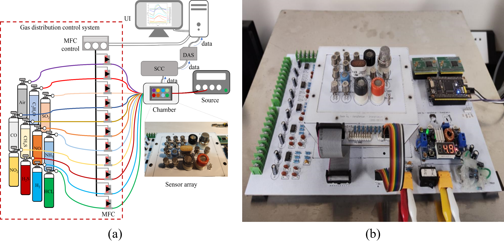








<!-- Lorem ipsum dolor sit amet, consectetur adipiscing elit. Vivamus ornare aliquet ipsum, ac tempus justo dapibus sit amet. Suspendisse condimentum, libero vel tempus mattis, risus risus vulputate libero, elementum fermentum mi neque vel nisl. Maecenas facilisis maximus dignissim. Curabitur mattis vulputate dui, tincidunt varius libero luctus eu. Mauris mauris nulla, scelerisque eget massa id, tincidunt congue felis. Sed convallis tempor ipsum rhoncus viverra. Pellentesque nulla orci, accumsan volutpat fringilla vitae, maximus sit amet tortor. Aliquam ultricies odio ut volutpat scelerisque. Donec nisl nisl, porttitor vitae pharetra quis, fringilla sed mi. Fusce pretium dolor ut aliquam consequat. Cras volutpat, tellus accumsan mattis molestie, nisl lacus tempus massa, nec malesuada tortor leo vel quam. Aliquam vel ex consectetur, vehicula leo nec, efficitur eros. Donec convallis non urna quis feugiat. -->

<!-- I am currently pursuing a Master of Science degree in Mechanical Engineering at Beihang University. My research primarily focuses on machine design and machine vision, conducted within the State Key Laboratory of Virtual Reality Technology and Systems. Under the guidance of my academic advisor, Associate Professor Hanjun Gao, my work is dedicated to advancing the field through innovative approaches and cutting-edge technology. -->

<!-- My research interest includes neural machine translation and computer vision. I have published more than 100 papers at the top international AI conferences with total <a href='https://scholar.google.com/citations?user=DhtAFkwAAAAJ'>google scholar citations <strong>260000+</strong></a> (You can also use google scholar badge ). -->

I am currently pursuing a Master degree in Control Engineering at Zhejiang University. My research primarily focuses on robot navigation and path planning based on large language model, conducted within the State Key Laboratory of Industrial Control Technology. Under the guidance of my academic advisors, Professor <a href='https://person.zju.edu.cn/0097062'>Rong Xiong</a> and Professor <a href='https://ywang-zju.github.io/'>Yue Wang</a>, my work is dedicated to advancing the development of this field through innovative methods and cutting-edge technology.

My main research areas include robotics, navigation, SLAM, deep learning, and intelligent sensors. I have submitted 2 papers in SCI journals. Please visit my own <a href='https://space.bilibili.com/349906952?spm_id_from=333.337.search-card.all.click'>Bilibili</a> Channel and our Lab’s <a href='https://space.bilibili.com/544651460?spm_id_from=333.337.search-card.all.click'>Bilibili</a> Channel for more information.

# 🔥 News
- *2024.02*: &nbsp;🎉🎉 Our recent work has been accepted by Engineering Applications of Artistic Intelligence (EAAI).
- *2023.07*: &nbsp;🎉🎉 Our recent work has been accepted by IEEE Transactions on Instrumentation and Measurement (IEEE TIM).
- *2023.07*: &nbsp;🎉🎉 Our team has won the third prize in the China University Robot Competition(Robocon).
- *2022.08*: &nbsp;🎉🎉 Our team has won the first prize in the China Robotics and Artificial Intelligence Competition(Baidu Apollo Autonomous Driving Track).
- *2022.08*: &nbsp;🎉🎉 Our team has won the second prize in the Infantry individual events(Robomaster).

# 📝 Publications 

<!-- 

EAAI

 -->

<!-- 

EAAI

 --> 

[M2FL-CCC: Multibranch Multilayer Feature Leaning and Comprehensive Classification Criterion for Gas Sensor Drift Compensation](https://ieeexplore.ieee.org/document/10187901)

**Shichao Zhai**, Mingye Han, Zhe Li, Shuangjing Yang, Shukai Duan, Jia Yan

[**Project**](https://github.com/zhai-create/E-nose-NN) <strong></strong>
- The model does not depend on the target domain samples in the training stage, which is consistent with the actual application scenario.
- The use of a multibranch structure for customized multisensor feature extraction is more in line with the working mechanism of the mammalian olfactory perception system.
- A novel classification strategy based on a CCC is proposed. This strategy couples the classifier ensemble and the separation degree measure.

<!-- 

IEEE TIM

 -->

[A multilevel interleaved group attention-based convolutional network for gas detection via an electronic nose system](https://www.sciencedirect.com/science/article/pii/S0952197624001969?dgcid=coauthor)

**Shichao Zhai**, Zhe Li, Huisheng Zhang, Lidan Wang, Shukai Duan, Jia Yan

[**Project**](https://github.com/zhai-create/E-nose-NN) <strong></strong>
- The MIGACN is designed based on the actual physical significance of the signals and suitable for the time series of all the gas sensor responses, allowing the network structure to be more interpretable.
- Two kinds of attention modules (a temporal attention module and a channel attention module) are introduced to improve the feature learning ability of the network.
- The data augmentation module helps the network achieve excellent generalization performance and satisfies the practical requirement for fast dynamic gas detection of E-noses.

<!-- - [Lorem ipsum dolor sit amet, consectetur adipiscing elit. Vivamus ornare aliquet ipsum, ac tempus justo dapibus sit amet](https://github.com), A, B, C, **CVPR 2020** -->

# 🎖 Honors and Awards
- *2023.11* Xiaomi Special Scholarship.
- *2023.08* Lorem ipsum dolor sit amet, consectetur adipiscing elit. Vivamus ornare aliquet ipsum, ac tempus justo dapibus sit amet. 
- *2023.07* The third prize in the National Robot Competition for College Students.
- *2023.05* The Meritorious Winner of the American Mathematical Modeling Contest for College Students.
- *2023.05* I am grateful for the Chinese Modern and Contemporary Scientists Scholarship
- *2023.03* The first prize in the National College Student Mathematics Competition in Chongqing.
- *2022.12* The National Scholarship.
- *2022.11* The first prize in the National College Student Mathematical Modeling Competition in Chongqing.
- *2022.08* The first prize in the China Robotics and Artificial Intelligence Competition (Baidu Apollo Urban Road Autonomous Driving Virtual Simulation Competition).
- *2022.08* The second prize in the National Robot Master Competition for College Students.
- *2021.12* The National Scholarship.
- *2021.09* Lorem ipsum dolor sit amet, consectetur adipiscing elit. Vivamus ornare aliquet ipsum, ac tempus justo dapibus sit amet. 
- *2020.12* The National Inspirational Scholarship.

# 📖 Educations
- *2024.09 - 2027.06 (now)*, State Key Laboratory of Industrial Control Technology, Zhejiang University, Hangzhou. 
- *2020.09 - 2024.06*, College of Artificial Intelligence, Southwest University, Chongqing, (GPA: 4.39/5.0, rank: 1/91).

<!-- # 💬 Invited Talks
- *2021.06*, Lorem ipsum dolor sit amet, consectetur adipiscing elit. Vivamus ornare aliquet ipsum, ac tempus justo dapibus sit amet. 
- *2021.03*, Lorem ipsum dolor sit amet, consectetur adipiscing elit. Vivamus ornare aliquet ipsum, ac tempus justo dapibus sit amet.  \| [\[video\]](https://github.com/) -->

# 💻 Internships
- *2023.01 - 2023.02*, [Dongguan Songshan Lake Robot Industry Base](https://www.xbotpark.com/), Dongguan, China.
- *2023.05 - 2023.07*, [Intel FPGA China Innovation Center](https://www.fpga-china.com/), Chongqing, China.

<!-- # 💻 Societies
- *2019.05 - 2020.02*, [Lorem](https://github.com/), China. -->